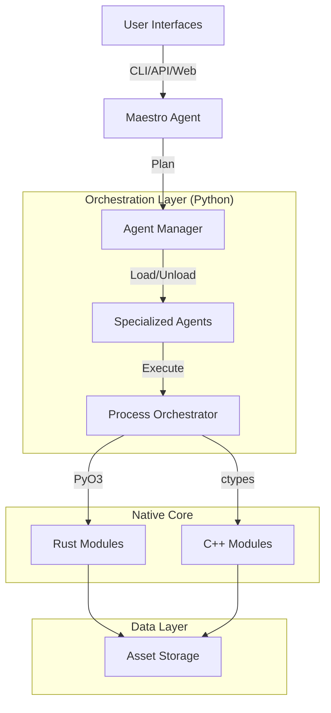

# 🧬 VaultMind Forge

[](./scripts/build_native.py)
[](https://www.python.org/)
[](https://www.rust-lang.org/)
[](https://isocpp.org/)
[](./LICENSE.md)

**Enterprise AI-Powered Asset Generation & Processing Pipeline**

VaultMind Forge is a production-ready, multi-language asset generation framework designed for high-fidelity game development, 3D content creation, and procedural workflows. It combines the ease of Python orchestration with the raw performance of Rust and C++ native modules.

> **🚀 New in v2.0:** Unified Native Build System, Maestro Agent Orchestrator, and Dynamic Resource Management.

---

## 📖 Table of Contents
- [Overview](#-overview)
- [Key Features](#-key-features)
- [Architecture](#-architecture)
- [Getting Started](#-getting-started)
- [Agent System](#-agent-system)
- [Usage](#-usage)
- [Development](#-development)
- [Contributing](#-contributing)

---

## 🔭 Overview

VaultMind Forge is not just a tool; it's a complete ecosystem for asset lifecycle management. From ingestion to generation, validation, and export, every step is tracked with cryptographic lineage fidelity.

**System Scale:**
*   **138+ Processing Modules** across Python, Rust, and C++.
*   **5 Autonomous AI Agents** for quality control and optimization.
*   **Maestro Orchestrator** for high-level task planning.
*   **Multi-Interface:** Web UI (React), CLI, and REST API.

---

## ✨ Key Features

### 🎨 Multi-Pass AI Generation
*   **Stable Diffusion XL (SDXL)** integration for high-fidelity textures and concepts.
*   **Video Generation** with frame stitching and transition effects.
*   **Procedural Generation** via Rust-powered noise algorithms.

### 🤖 Autonomous Agent System
*   **Maestro Agent**: A master planner that decomposes complex requests into executable sub-tasks.
*   **Quality Guardian**: Automatically monitors asset quality and rejects substandard outputs.
*   **Resource Monitor**: Deterministic agent ensuring system stability under load.
*   **Dynamic Management**: Intelligent loading/unloading of agents to minimize memory footprint.

### ⚡ High-Performance Native Core
*   **Rust Validators**: 10-50x faster image analysis (color fidelity, contrast, sharpness) via `pyo3`.
*   **C++ SIMD Modules**: AVX2-optimized color space conversions and heavy math operations.
*   **Unified Build**: Single-script compilation for all native components.

### 🛡️ Lineage & Integrity
*   **Genealogy Tracking**: Every asset knows its parents.
*   **SHA-256 Checksums**: Guarantee asset integrity at every stage.
*   **VAF Format**: Custom VaultMind Asset Format for optimized storage and streaming.

---

## 🏗️ Architecture

VaultMind Forge uses a hybrid architecture to balance flexibility and performance.



---

## 🚀 Getting Started

### Prerequisites
*   **Python 3.10+**
*   **Rust** (via `rustup`)
*   **C++ Compiler** (`g++` or MSVC `cl.exe`)
*   **Node.js 18+** (for Web UI)

### Installation

1.  **Clone the repository:**
    ```bash
    git clone https://github.com/yourusername/vaultmind-forge.git
    cd vaultmind-forge
    ```

2.  **Install Python dependencies:**
    ```bash
    pip install -r requirements.txt
    ```

3.  **Build Native Components (Crucial):**
    We provide a unified build script to compile both Rust and C++ modules.
    ```bash
    python scripts/build_native.py
    ```
    *This will compile the Rust `vmf_validator` extension and the C++ `validator` shared library.*

4.  **Install Web UI dependencies (Optional):**
    ```bash
    cd web_ui
    npm install
    ```

---

## 🧠 Agent System

VaultMind Forge employs a sophisticated agentic architecture.

### The Maestro
The **Maestro Agent** (`forge_agents/maestro_agent.py`) is the brain of the operation. It uses a high-level LLM (via `UnifiedAgentBackend`) to understand natural language requests and create execution plans.

### Programmatic Agents
For deterministic tasks, we use **Programmatic Agents** (`forge_agents/programmatic_agent.py`). These are code-based agents that execute fast, reliable logic without AI inference latency.
*   **ResourceMonitor**: Checks CPU/RAM/GPU usage.
*   **FileManager**: Handles asset organization.

### Dynamic Resource Management
The **Agent Manager** (`forge_agents/agent_manager.py`) ensures your system doesn't run out of memory. It uses an LRU (Least Recently Used) caching strategy to keep only active agents in memory, dynamically loading and unloading them as needed.

---

## 💻 Usage

### CLI
The Command Line Interface is the fastest way to interact with the Forge.

```bash
# Run a validation check
vaultmind validate ./my_asset.png

# Ask the Maestro to perform a complex task
vaultmind run "Check system resources and then generate a sci-fi crate texture"
```

### Web UI
Launch the visual node editor for a drag-and-drop workflow experience.

```bash
# Windows
START_WEB_UI.bat

# Manual
cd backend && python api.py
cd web_ui && npm run dev
```
Access at `http://localhost:3000`.

### Python API
Integrate Forge directly into your pipeline.

```python
from vaultmind_forge.forge_validator import get_validator
from pathlib import Path

# Use the high-performance Rust backend
validator = get_validator(backend_name="rust")
result = validator.validate(Path("./texture.png"))

print(f"Sharpness: {result['sharpness']}")
```

---

## 🛠️ Development

### Running Tests
We use `pytest` for comprehensive testing.

```bash
# Run all tests
pytest

# Run specific native integration tests
python tests/test_native_integration.py

# Run agent system tests
python tests/test_agent_manager.py
```

### Adding a New Module
1.  Create your module in `vaultmind_forge/`.
2.  If it requires native code, add it to `native/rust` or `native/cpp`.
3.  Update `scripts/build_native.py` to include your new native component.
4.  Register it with the `AgentManager` if applicable.

---

## 🤝 Contributing

We welcome contributions! Please see [CONTRIBUTING.md](./CONTRIBUTING.md) for details.

1.  **Fork** the repo.
2.  **Create** a feature branch.
3.  **Commit** your changes (ensure lineage fidelity!).
4.  **Push** and create a **Pull Request**.

---

## 📜 License

This project is licensed under the MIT License - see the [LICENSE.md](./LICENSE.md) file for details.

---

**VaultMind Forge** — *Forging the future of digital assets.*
